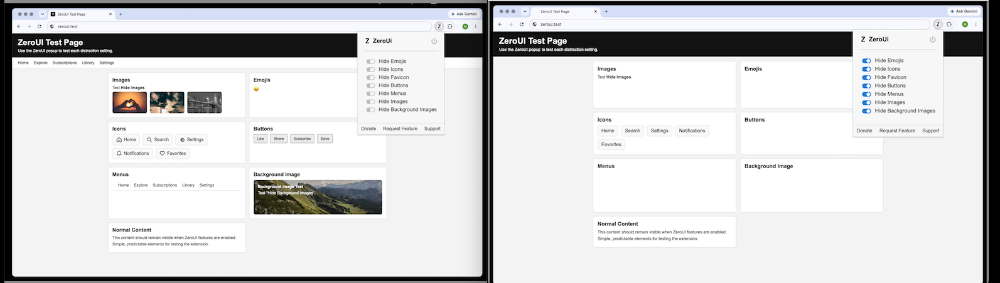

# ZEROUI

**Remove visual noise. Focus on content.**

ZEROUI is a Chrome extension that helps simplify webpages by letting you hide unwanted visual elements.

## Features

ZEROUI currently provides **7 independent controls**:

* **Hide Emojis** — removes emojis from webpages
* **Hide Icons** — hides icons and small UI graphics
* **Hide Favicon** — hides website favicons
* **Hide Buttons** — hides buttons and button-style elements
* **Hide Menus** — hides navigation and menu elements
* **Hide Images** — hides images on webpages
* **Hide Background Images** — removes CSS background images

Each option can be enabled or disabled independently.

## Why ZEROUI?

Modern websites can contain a lot of visual elements that aren't necessary for reading or completing a task.

ZEROUI gives you control over what stays visible.

**Less visual noise. More focus.**

## Beta

ZEROUI is currently in **beta**.

This release is intended for testing and feedback. Some websites may behave differently when visual elements are hidden, and certain elements may not be detected correctly.

Your feedback will help improve compatibility and usability.

## Installation

ZEROUI is currently distributed as a beta extension and is not yet available on the Chrome Web Store.

### Install manually

1. Download or clone this repository.
2. Open Chrome.
3. Go to `chrome://extensions`.
4. Enable **Developer mode**.
5. Click **Load unpacked**.
6. Select the ZEROUI project folder.
7. ZEROUI will appear in your extensions list.

After making changes to the extension, return to `chrome://extensions` and click **Reload**.

## Project Structure

```text
ZEROUI/
├── manifest.json
├── popup.html
├── support.html
├── donate.html
│
├── js/
│   ├── background.js
│   ├── popup.js
│   └── content.js
│
├── css/
│   ├── popup.css
│   ├── info.css
│   └── content.css
│
├── images/
│   ├── icon-16.png
│   ├── icon-32.png
│   ├── icon-48.png
│   └── icon-128.png
│
└── screenshots/
    ├── main-popup.png
    └── before-after.png
```

## Screenshots

### ZEROUI Popup


### Before & After



## Beta Feedback

If you're testing ZEROUI, please share:

* Which feature you used
* Which website you tested
* What worked well
* What didn't work
* Any layout or compatibility issues
* What feature you'd like to see next

When reporting a problem, including the website URL and the ZEROUI settings you were using is especially helpful.

## Development

ZEROUI is built with:

* **Chrome Extensions Manifest V3**
* **JavaScript**
* **HTML**
* **CSS**
* **Chrome Storage API**

The extension runs on webpages and modifies their visual presentation locally in the browser.

## Privacy

ZEROUI is designed to modify webpage appearance locally.

**ZEROUI does not collect or send user data.**

## Roadmap

Planned improvements will be guided by beta feedback.

Potential areas include:

* Better support for dynamically loaded webpages
* More precise element detection
* Improved performance
* Better popup controls
* Additional customization options

## License

License information will be added before the public release.

---

**ZEROUI — Remove noise. Focus on content.**
